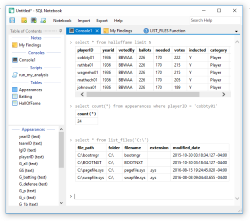

SQL Notebook is a free Windows desktop application for **exploring and manipulating tabular data**.  It is powered by [SQLite](https://www.sqlite.org/).  Every notebook file is an SQLite database, and the user writes SQL queries to interact with input data.

### Data Sources
- **Microsoft SQL Server**, **PostgreSQL**, and **MySQL** tables can be linked into the notebook and queried interchangeably with local tables.  Remote data is not physically copied into the notebook file unless requested; instead, the data source is queried on-the-fly.

- **CSV**, **JSON**, and **Excel** files can be imported into the notebook as local SQLite tables.

- Any combination of data sources can be used together in the same SQL query, including cross-file, cross-database, and cross-server queries.

- Tables and scripts can be exported in **CSV** format.

### Queries
SQL Notebook offers two standard user interfaces for entering SQL queries:

<a href="video-console.html" target="_blank">
<video width="125" height="105" autoplay loop><source src="art/console-small.mp4" type="video/mp4"></video>
</a>

**Console**: A command prompt.  Enter SQL commands interactively and see results inline in text form.  The command history and output log of each console are retained in the notebook file for the user's future reference.

<a href="video-script.html" target="_blank">
<video width="125" height="105" autoplay loop><source src="art/script-small.mp4" type="video/mp4"></video>
</a>

**Script**: A syntax-colored text editor and a result data grid.  Run a script directly by pressing F5, or invoke it from consoles and other scripts using [`EXECUTE`](extended-syntax.html#execute).  The script may define input parameters using [`DECLARE PARAMETER`](extended-syntax.html#declare).

Queries can take advantage of familiar **structured programming** constructs:

- Variables ([`DECLARE`](extended-syntax.html#declare), [`SET`](extended-syntax.html#set))
- Control flow ([`IF`/`ELSE`](extended-syntax.html#if), [`WHILE`](extended-syntax.html#while))
- Error handling ([`THROW`](extended-syntax.html#throw), [`TRY`/`CATCH`](extended-syntax.html#try))
- Stored procedures ([`EXECUTE`](extended-syntax.html#execute))

### Documentation
User-created documents can be stored directly in notebook files. The app includes extensive help documentation accessible without leaving the notebook window.

<a href="video-note.html" target="_blank">
<video width="125" height="105" autoplay loop><source src="art/note-small.mp4" type="video/mp4"></video>
</a>

**Note**: A user-written text document.  Standard word processing features are available: fonts, colors, and paragraph alignment.  Console output can be copied into a note for annotation.  SQL-style comments may also be used in scripts and consoles for inline documentation.

<a href="video-help.html" target="_blank">
<video width="125" height="105" autoplay loop><source src="art/help-small.mp4" type="video/mp4"></video>
</a>

**Help Viewer**: The searchable, in-application help system.  Press F1 to view the index of help documents, or enter a keyword into the "Search Help" box in the upper-right corner of the SQL Notebook window.  SQLite and SQL Notebook documentation is included.

### License
SQL Notebook is **free and open source** software available under the popular [MIT license](license.html).  [View the project on GitHub!](https://github.com/electroly/sqlnotebook)

Copyright © 2016 [Brian Luft](https://github.com/electroly)
